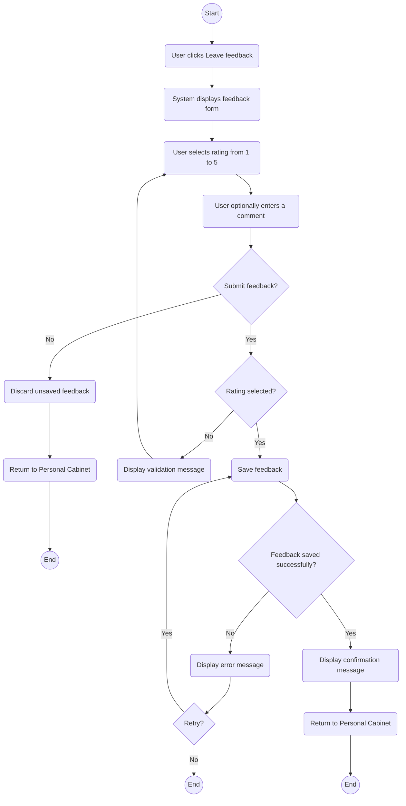

# Feature: Personal Cabinet
## Use Case: Leave Feedback

The main participants are the User and the System. The diagram illustrates how an authorised user rates a completed booking from 1 to 5 stars and optionally leaves written feedback.

